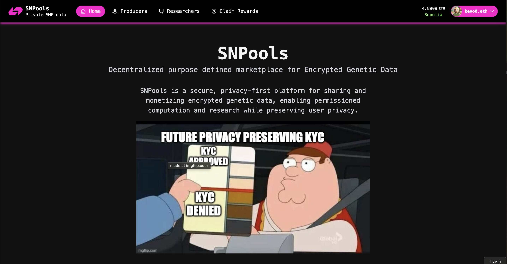

# SNPools

Decentralized purpose defined marketplace for Encrypted Genetic Data

## Problem

Centralized genetic data platforms often misuse or sell user data without consent, compromising privacy and failing to fairly compensate data owners.

## Solution

SNPools encrypts genetic data using Fully Homomorphic Encryption (FHE) and Zero-Knowledge (ZK) proofs, allowing computations and research without exposing raw data. Users retain full control and can monetize their data securely.

## Technology Stack

- Noir
- Concrete ML from ZAMA
- Solidity / EVM
- Python
- React, Typescript

## Privacy Impact

All genetic data is fully encrypted and never leaves user control. Computations are performed on encrypted data, ensuring privacy and self-sovereignty. No third party can access raw genetic information.

## Real-World Use Cases

- Individuals monetizing their genetic data for research or pharma, with full privacy.
- Researchers training models on encrypted datasets without risking data leaks.
- Privacy-preserving health analytics and ancestry services.

## Business Logic

Users earn rewards or payments when their encrypted data is used for computation. The platform takes a small fee per transaction, ensuring sustainability while maximizing user profit and privacy.

## What's Next

Future plans include exploring shared genetic ownership, family-based permissions, cross-chain interoperability and genetic prediction market. We aim to expand privacy tools and support new data types and computation models.
